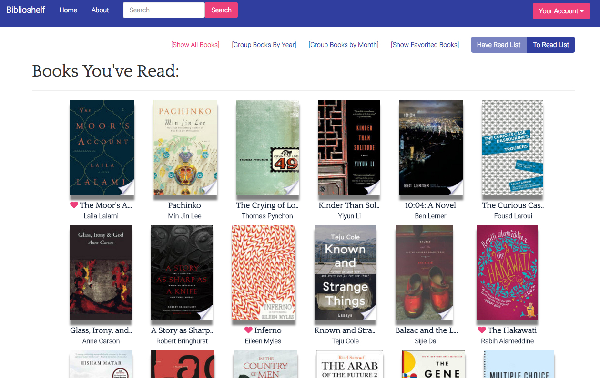
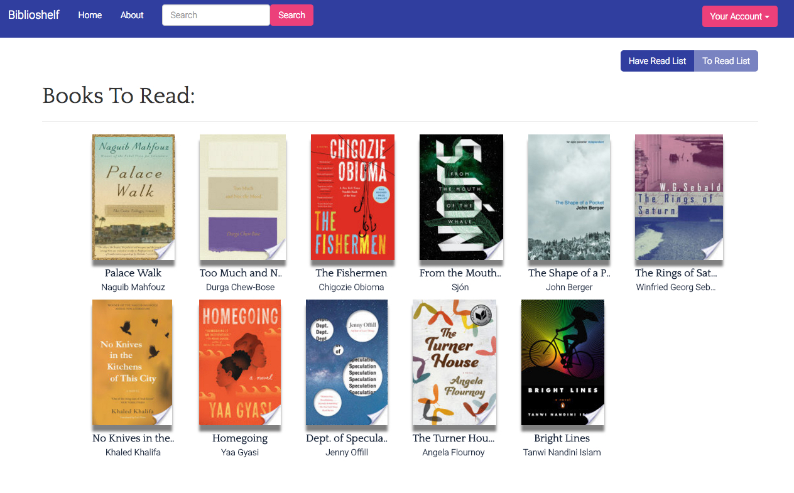
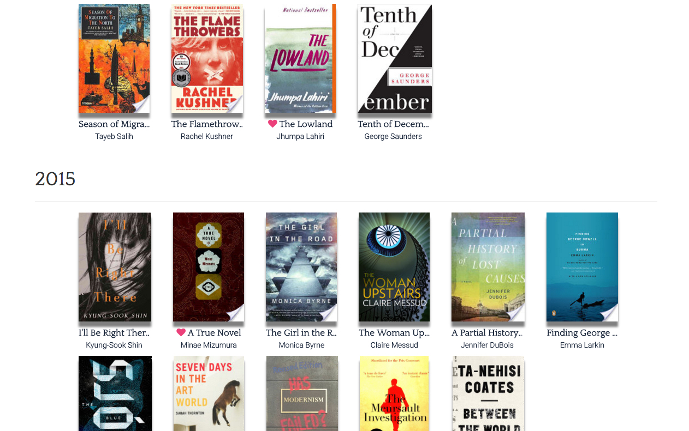
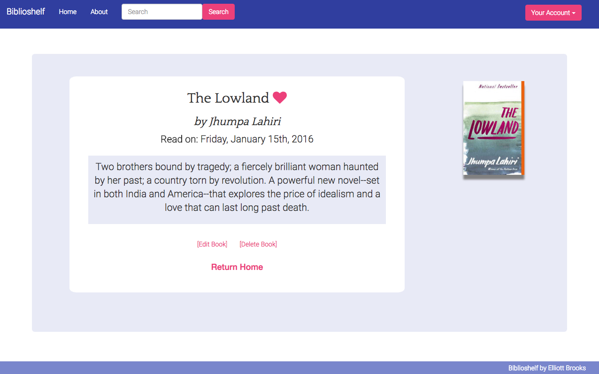

# Biblioshelf

Biblioshelf is an all-in-one tool that lets readers keep track of all the books that they've read and all the books that they hope to read. Readers can add a new book with just the click of a button, take notes on each book with Markdown, favorite books that they love, and toggle between viewing all the books that they've read and all the books that they've saved to read later.

## Technologies: 

Biblioshelf is a single-page application built atop a RESTful API. Its backend was created with Node and Express, with a PostgreSQL database and Sequelize as its ORM. React, React Router, and React-Redux power Biblioshelf's frontend. Biblioshelf is integrated with the Google Books API to fetch book metadata for its users. Finally, Biblioshelf uses bcrypt for its user authentication.

## Images of the Application: 

1. Books read list:
> When users log into Biblioshelf, they can view all the books they've read, sorted by date.

2. To read book list: 
> Users can keep track of the books that they would like to read later in their *to read* list. Once they've read a book, they can click *mark as read* and move the book to their *read books* list.

3. Organizing books: 
> Users can group the books they've read by year or month, or choose to see only the books that they've favorited. 

3. Taking notes on each book: 
> Users can take notes on each and every book that they've read, and view these notes by clicking on a book.  

